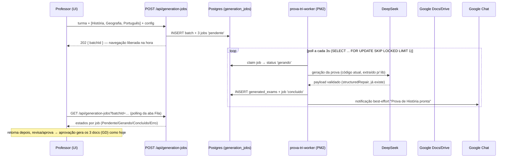
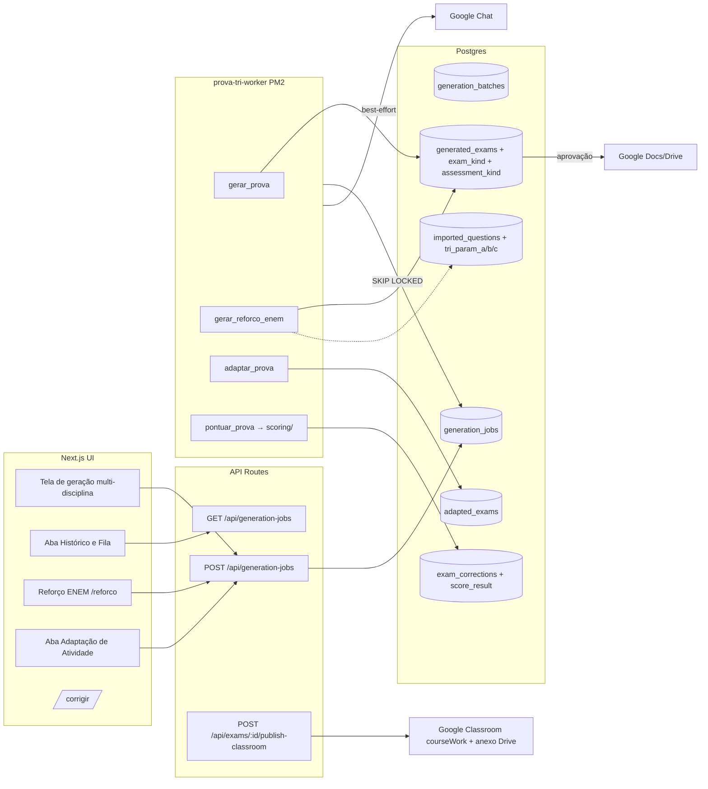

# Especificação — Expansão do Sistema de Avaliação e Aprendizagem

**Data**: 26/07/2026
**Status**: implementada para a regra de correção, banco ENEM oficial e
importação 2024-2025; a expansão de cobertura histórica continua incremental.
**Escopo**: 4 módulos — (1) Correção e Pontuação (Percentual × TRI),
(2) Fila assíncrona de geração (Background Jobs), (3) Intervenção
Pedagógica por Habilidades INEP + Google Classroom, (4) Adaptação
Inclusiva para alunos laudados.

Princípio geral (mesmo do Motor de Classificações): **tudo aditivo** —
nenhum módulo migra ou reescreve dado existente. `generation_payload`,
`exam_corrections.answers` e `imported_question_classifications`
permanecem intocados; os módulos novos referenciam, nunca alteram.

---

## 1. Regras de Correção e Pontuação

### 1.1 Regra de negócio

| Tipo de avaliação | Metodologia | Escala |
|---|---|---|
| Prova/atividade sem item real ENEM | Percentual simples | 0% a 100% (nota decimal 0–10 derivada) |
| Prova mista com itens reais ENEM | Percentual geral + TRI INEP sobre os itens calibrados | 0% a 100% + 0 a 1000 |
| Reforço ENEM com resposta individual | Percentual geral + TRI INEP sobre os itens calibrados | 0% a 100% + 0 a 1000 |
| SAE ENEM importado externamente | Indicadores descritivos de acerto e evolução | Percentual e p.p. |

**Gatilho**: a presença de questão objetiva `enem_bank` ativa o fluxo TRI.
Na correção, só os itens com parâmetros oficiais INEP entram no cálculo; os
demais continuam no percentual geral. `assessment_kind` é apenas um rótulo
pedagógico. O SAE externo não participa desse fluxo.

### 1.2 Mudança de schema (migration manual, padrão 0007)

```sql
ALTER TABLE generated_exams
  ADD COLUMN assessment_kind text NOT NULL DEFAULT 'padrao',
  -- 'padrao' | 'enem'
  ADD COLUMN scoring_method text NOT NULL DEFAULT 'percentual';
  -- 'percentual' | 'tri' — derivado da origem das questões, materializado
  -- pra consulta barata em /desempenho e /status
```

Constante em `schema.ts`:

```ts
export const ASSESSMENT_KINDS = ['padrao', 'enem'] as const
export const SCORING_METHODS = ['percentual', 'tri'] as const
```

Regra de derivação (única fonte, `src/lib/scoring/scoringPolicy.ts`):

```ts
export function scoringMethodForQuestions(questions: ScorableQuestion[]): ScoringMethod {
  return questions.some((question) => question.type === 'objetiva' && question.source === 'enem_bank')
    ? 'tri'
    : 'percentual'
}
```

Nenhuma rota deve comparar `assessment_kind` direto pra decidir escala —
sempre via `scoringPolicy.ts` (mesma disciplina do `isStaffSuperuser`).

### 1.3 Motor percentual (`src/lib/scoring/percentualScorer.ts`)

- Objetivas: acerto binário contra o gabarito do payload (determinístico,
  como já é hoje em `/corrigir`).
- Discursivas: `finalGrade` 0–10 por questão (fluxo atual, sugestão de IA
  + revisão humana — nada muda).
- Nota da prova: média ponderada por pontos da questão → percentual
  0–100% + decimal 0–10. É a formalização do que o `/desempenho` já faz.

### 1.4 Motor TRI (`src/lib/scoring/triScorer.ts`) — regra de honestidade

TRI de verdade exige **parâmetros calibrados por item** (a, b, c do
modelo logístico de 3 parâmetros). Não existe TRI legítima sem isso.
Consequências obrigatórias (mesmo espírito do "nunca inventar código
BNCC"):

1. **Questões do banco ENEM real**: os microdados do INEP publicam
   `NU_PARAM_A`, `NU_PARAM_B`, `NU_PARAM_C` por item calibrado. O
   pipeline de importação já casa questões por posição+gabarito nos
   microdados — **estender a importação para capturar os 3 parâmetros**
   em colunas novas de `imported_questions`
   (`tri_param_a/b/c real NULL` + `tri_param_source text NULL`). Só
   itens com parâmetros oficiais INEP entram no cálculo TRI. O painel SAE
   externo não fornece nem usa parâmetros TRI neste produto.
2. **Questões autorais ou geradas por IA**: não têm calibração (não é
   possível estimar uma TRI válida com a amostra de uma turma; o INEP usa
   pré-teste nacional). **Nunca recebem parâmetro inventado.** Elas entram
   no percentual e podem receber uma estimativa pedagógica interna, exibida
   sempre como aproximação e fora da nota TRI INEP.
3. **Regra de composição**: qualquer prova ou atividade com itens objetivos
   `enem_bank` calcula TRI sobre o subconjunto com parâmetro oficial INEP. O resultado
   informa sempre `itemsUsed`/`itemsTotal`. Se a cobertura for < 70% dos
   itens objetivos, o sistema exibe a cobertura incompleta e mostra também
   o percentual simples ao lado. Se for
   0 itens calibrados, não exibe TRI — cai pra percentual com aviso.
4. **Estimação**: θ por EAP (Expected A Posteriori) com prior N(0,1) e
   quadratura em grade (61 pontos em [-4, +4]) — implementação própria
   de ~40 linhas, sem dependência nova. Conversão à escala ENEM:
   `score = 500 + 100·θ`, truncado a [0, 1000].
5. **Escopo por área**: como no ENEM real, θ é estimado por área do
   conhecimento (o simulado típico aqui é de uma área só — 1 θ por
   prova). Discursivas **não entram na TRI** (o ENEM não tem
   discursiva TRI; redação é rubrica à parte) — num simulado ENEM,
   discursivas são pontuadas em rubrica separada e reportadas fora do
   0–1000.

### 1.5 Persistência do resultado

Nada de recalcular na leitura: quando a correção da prova fecha
(status `corrigido` / todas as correções `revisado`), o worker (módulo 2)
roda o scorer e grava em coluna nova de `exam_corrections`:

```sql
ALTER TABLE exam_corrections
  ADD COLUMN score_result jsonb;
-- percentual: { "method":"percentual", "percent":72.5, "decimal":7.25 }
-- tri:        { "method":"tri", "score":612, "theta":1.12, "sem":0.31,
--               "itemsUsed":40, "itemsTotal":45, "approximate":false }
```

`/desempenho` mostra a escala certa conforme `scoring_method` da prova —
nunca mistura 0–1000 com 0–100% num mesmo agregado (agregações separam
por método).

---

## 2. Fila Assíncrona de Geração (Background Jobs)

### 2.1 Decisão de tecnologia

**Fila em Postgres puro** (tabela + `FOR UPDATE SKIP LOCKED`) com um
**worker Node dedicado como segundo processo PM2** (`prova-tri-worker`).

Por quê, e não BullMQ/Redis ou n8n:
- Regra 8 do CLAUDE.md raiz: infraestrutura em `192.168.1.218` é legado
  a migrar — não adicionar serviço novo (Redis) que precisaria migrar
  junto. Postgres já existe, é transacional com o resto do dado.
- Volume real: dezenas de provas/dia no pico, não milhares/segundo.
  `SKIP LOCKED` em Postgres atende isso com folga e com durabilidade
  grátis (job sobrevive a restart).
- O worker reusa o mesmo código de geração das rotas atuais — a única
  mudança nas rotas é *enfileirar* em vez de *executar*.

### 2.2 Schema (2 tabelas novas)

```sql
CREATE TABLE generation_batches (
  id serial PRIMARY KEY,
  requested_by integer NOT NULL REFERENCES users(id),
  segment text NOT NULL,             -- anos-iniciais | anos-finais | ensino-medio
  grade_year integer NOT NULL,
  academic_year integer NOT NULL,
  class_label text,                  -- "4º Ano A" — turma, quando informada
  created_at timestamp NOT NULL DEFAULT now()
);

CREATE TABLE generation_jobs (
  id serial PRIMARY KEY,
  batch_id integer REFERENCES generation_batches(id),  -- nulo = job avulso
  job_type text NOT NULL,
  -- 'gerar_prova' | 'gerar_reforco_enem' | 'adaptar_prova' | 'pontuar_prova'
  payload jsonb NOT NULL,            -- input completo do job (auto-suficiente)
  status text NOT NULL DEFAULT 'pendente',
  -- 'pendente' | 'gerando' | 'concluido' | 'erro' | 'cancelado'
  priority integer NOT NULL DEFAULT 5,      -- menor = mais urgente
  attempts integer NOT NULL DEFAULT 0,
  max_attempts integer NOT NULL DEFAULT 2,
  result_exam_id integer REFERENCES generated_exams(id),
  result_ref jsonb,                  -- p/ jobs que não produzem exam (score, adaptação)
  error_message text,
  requested_by integer NOT NULL REFERENCES users(id),
  created_at timestamp NOT NULL DEFAULT now(),
  started_at timestamp,
  finished_at timestamp
);
CREATE INDEX generation_jobs_poll_idx
  ON generation_jobs (status, priority, id) WHERE status = 'pendente';
CREATE INDEX generation_jobs_requester_idx
  ON generation_jobs (requested_by, created_at DESC);
```

A fila é **genérica por `job_type`**: os módulos 3 (reforço) e 4
(adaptação) e o scoring (módulo 1) entram como tipos de job na mesma
infraestrutura — um único worker, um único painel.

### 2.3 Fluxo de dados



### 2.4 Worker (`scripts/generation-worker.ts` + entrada no `ecosystem.config.js`)

- Loop: claim atômico via
  `UPDATE generation_jobs SET status='gerando', started_at=now(), attempts=attempts+1
   WHERE id = (SELECT id FROM generation_jobs WHERE status='pendente'
   ORDER BY priority, id LIMIT 1 FOR UPDATE SKIP LOCKED) RETURNING *`.
- **Concorrência 1** no início (DeepSeek tem rate limit e o servidor é
  caseiro); paralelismo é um parâmetro, não uma reescrita.
- Erro: se `attempts < max_attempts`, volta a `pendente` (retry);
  senão `erro` + `error_message` legível (a mensagem do
  `StructuredGenerationError` já é adequada).
- **Recuperação de crash**: na subida, o worker devolve para `pendente`
  qualquer job preso em `gerando` há mais de 15 min (heartbeat simples
  via `started_at`).
- Carrega `.env.local` explicitamente (mesmo padrão do
  `seed-pedagogical-taxonomies` — script fora do Next não lê sozinho).
- ⚠️ Deploy: worker novo = entrada nova no PM2. Lembrar da regra de
  `.env.local` (`pm2 delete && pm2 start ecosystem.config.js && pm2 save`).

### 2.5 UI — aba "Histórico e Fila de Provas"

- Nova aba em `/status` (não uma página nova — o professor já olha
  `/status` pra acompanhar prova): filtro padrão "meus jobs", coordenação
  /direção vê tudo (mesmo RBAC via `isStaffSuperuser`).
- Estados exibidos: `Pendente`, `Gerando…`, `Concluído`, `Erro` (com
  botão "Tentar de novo" que reenfileira) e `Cancelado` (cancelável só
  enquanto `pendente`).
- Polling client-side a cada 5s enquanto houver job ativo (sem
  WebSocket/SSE por ora — PM2+Next em servidor caseiro, polling é
  robusto e suficiente; SSE fica como melhoria).
- Badge no menu com contagem de jobs ativos + toast quando um job do
  usuário conclui (o polling detecta a transição).
- Notificação Google Chat ao concluir cada item: DM pro solicitante,
  best-effort, padrão existente de `googleChat.ts`.
- A tela de geração atual ganha: seleção de turma/ano, **checkboxes de
  múltiplas disciplinas**, e o botão passa a "Adicionar à fila". Geração
  single vira um batch de 1 job — um caminho de código só.

### 2.6 Fluxo do usuário (workflow confirmado)

1. Seleciona Turma/Ano (ex.: 4º Ano A, 8º Ano B, 3º EM).
2. Marca 1..N disciplinas (☑ História ☑ Geografia ☑ Português).
3. Define configurações pedagógicas (bimestre, nº de questões,
   `assessment_kind` — módulo 1 — etc.) — config é por batch, com
   overrides por disciplina se necessário.
4. Dispara → `202 Accepted` → segue navegando.
5. Acompanha na aba Fila; ao concluir, revisa/edita/aprova/baixa cada
   prova pelo fluxo de revisão **existente** (nada muda do `rascunho`
   pra frente — a fila só substitui o "esperar a tela carregar").

---

## 3. Módulo de Intervenção Pedagógica (EM + Google Classroom)

### 3.1 Conceito

Gerador de **atividades de reforço por Habilidade INEP** (H1–H30),
alimentado pelo banco real do ENEM (2.689 questões, ~99% classificadas
por habilidade oficial) e pelos diagnósticos SAE já importados
(`enem_sae_imports`). Ensino Médio somente.

### 3.2 Reuso máximo: `exam_kind` em vez de tabela nova

```sql
ALTER TABLE generated_exams
  ADD COLUMN exam_kind text NOT NULL DEFAULT 'prova';
  -- 'prova' | 'reforco_enem'
```

Uma atividade de reforço **é** um `generated_exams` com
`exam_kind:'reforco_enem'` — herda de graça: fluxo de revisão/aprovação,
geração de documentos (`src/lib/docs/`), autorização
(`authorizeExamAccess`) e pasta no Drive. Os 3 entregáveis
mapeiam 1:1 nos 3 documentos que já existem:

| Entregável do módulo | Documento existente | Ajuste |
|---|---|---|
| Atividade | Prova (`provaDocBuilder`) | Cabeçalho "Atividade de Reforço", sem campo de nota |
| Gabarito Comentado | Gabarito (`gabaritoDocBuilder`) | Resolução passo a passo por questão (novo campo `commentedResolution` no payload, gerado por IA com `structuredRepair`) |
| Mapa da Atividade | Mapa (`mapaDocBuilder`) | Colunas: Questão × Habilidade INEP (código + descrição oficial de `enem_skills`) × dificuldade × objetivo de aprendizagem |

### 3.2.1 Coleções separadas na interface (24/07/2026)

O reuso de `generated_exams` é interno. Para o usuário, os produtos ficam
separados para não confundir avaliação formal com treino formativo:

- **Provas** (`/status`): somente `exam_kind:'prova'`, fila de
  `gerar_prova` e `adaptar_prova`, correção formal e integrações de notas.
- **Atividades** (`/atividades`): somente `exam_kind:'reforco_enem'`, fila de
  `gerar_reforco_enem`, revisão e documentos de atividade.
- O Reforço ENEM encaminha para a fila de **Atividades**; os badges e os
  avisos de conclusão também mantêm as duas filas isoladas.
- Indicadores institucionais de Desempenho consideram somente provas
  revisadas. Atividades de reforço não entram em média, maior/menor nota,
  Bloom, DOK, BNCC ou perfis cognitivos institucionais.
- A lista de prova formal disponível em turma/Classroom também filtra
  `exam_kind:'prova'`, prevenindo lançamento de atividade formativa como nota.

### 3.3 Entradas

1. **Turma/ano EM** (turma do Classroom opcional já na criação — ao
   contrário da prova comum, aqui o destino Classroom é parte do fluxo).
2. **Habilidades INEP**: seleção **manual** (multi-select H1–H30 com
   descrição oficial) ou **automática** — botão "Sugerir pelas
   deficiências detectadas" que ranqueia as piores habilidades a partir
   de: (a) último `enem_sae_imports.analysis` da turma/bimestre e
   (b) `topMissedQuestions`/eixos INEP do `/api/analytics/performance`.
   Sugestão é pré-seleção editável — decisão final é sempre humana
   (mesmo princípio da nota sugerida por IA).
3. **Quantidade de exercícios** (ex.: 15).

### 3.4 Seleção de questões

- Fonte primária: `imported_questions` filtrado por `enem_skill_id`
  (join via classificação existente), distribuindo equilibradamente
  entre as habilidades pedidas e variando nível de Bloom/eixo cognitivo
  (mesma lógica de "auto-seleciona as N melhores" da tela de geração EM).
- Se o banco não tiver itens suficientes para uma habilidade: completar
  com questões geradas por IA **rotuladas `source:'ia'`** no payload e
  no mapa ("baseada na habilidade HX", nunca apresentada como questão
  real do ENEM).
- Execução: job `gerar_reforco_enem` na fila do módulo 2.

### 3.5 Integração Google Classroom — "Publicar no Google Classroom"

Botão disponível quando a atividade está `aprovado` (documentos
existem). Passos do handler (novo `publishCourseWorkWithMaterial` em
`classroomClient.ts`, evolução do `createCourseWork` atual que hoje não
aceita anexo):

1. Exportar a Atividade como PDF (`drive.files.export` do Doc → upload
   do PDF na pasta da prova) — PDF congela a diagramação pro aluno.
2. Garantir permissão de leitura do arquivo pro domínio
   (`permissions.create` role `reader`, type `domain`) — o arquivo é do
   service account; sem isso o anexo aparece quebrado pro aluno.
3. `POST /v1/courses/{courseId}/courseWork` com `materials[].driveFile`
   (payload completo na seção 7).
4. Persistir `classroomCourseWorkId` (coluna já existe — mesmo
   idempotência da Subtarefa 5: cria uma vez, reusa depois).

⚠️ Escopos: `classroom.coursework.students` (já concedido na
Subtarefa 5) cobre a criação com anexo. O passo 2 usa o Drive do
service account (já usado pra criar os docs) — **nenhum escopo OAuth
novo**, logo sem armadilha de reautorização desta vez.

Título padrão: `[Reforço ENEM] Treino Focado nas Habilidades: H5, H18, H22`
(códigos ordenados numericamente; editável antes de publicar).

---

## 4. Módulo de Adaptação Inclusiva (alunos laudados)

### 4.1 Bibliotecas de adaptação (config versionada, não tabela)

`src/config/adaptationLibraries.ts` — mesmo padrão de
`saebApplicability.ts`/`pedagogicalConfidence.ts`: catálogo em código,
versionado no git, com `version` por biblioteca (gravada nos metadados
de cada adaptação pra auditoria). Estrutura:

```ts
export type AdaptationLibrary = {
  id: 'tea' | 'tdah' | 'discalculia' | 'baixa_visao'   // extensível
  label: string
  version: string                    // ex.: "1.0"
  contentDirectives: string[]        // regras de linguagem/estrutura → prompt da IA
  layoutRules: {                     // regras determinísticas → docBuilder, NÃO IA
    minFontPt?: number               // baixa_visao: 18 (corpo) / 20 (comandos)
    fontFamily?: 'sans-serif'
    lineSpacing?: number             // multiplicador
    paragraphSpacingPt?: number
    boldCommandKeywords?: boolean    // tdah: negrito em NÃO/INCORRETA/EXCETO…
    extraAnswerSpace?: boolean       // discalculia: espaço ampliado de cálculo
    highContrast?: boolean
    formulaSupportHeader?: boolean   // discalculia: tabela de fórmulas no cabeçalho
    visualSupports?: 'add' | 'remove_nonessential' | 'keep'
  }
  conflictPriority: number           // desempate no merge (menor vence)
}
```

Separação deliberada: **conteúdo** (reescrita de enunciado) é trabalho
da IA guiada pelas `contentDirectives`; **diagramação** (fonte,
espaçamento, negrito) é determinística no `provaDocBuilder` — nunca
pedir pra IA "aumentar a fonte", isso é regra de renderização.

Conteúdo inicial das 4 bibliotecas — exatamente a matriz do pedido:

- **TEA** (`conflictPriority: 1`): linguagem literal e direta; eliminar
  figuras de linguagem, ironia, duplo sentido; comandos visuais claros;
  diagramação espaçada; suporte visual/iconográfico explicativo
  (`visualSupports:'add'`).
- **TDAH** (`conflictPriority: 2`): negrito nas palavras-chave do
  comando; fragmentar enunciados longos em bullets/etapas; remover
  visuais distratores não essenciais (`visualSupports:'remove_nonessential'`).
- **Discalculia** (`conflictPriority: 3`): esquemas de apoio gráfico;
  tabela de fórmulas/guia de operações no cabeçalho; espaçamento
  ampliado pra cálculo; **sem alterar o raciocínio lógico exigido**.
- **Baixa Visão** (`conflictPriority: 4`): fonte ≥18pt (corpo) / 20pt
  (comandos), sans-serif; alto contraste; espaçamento ampliado de linhas
  e parágrafos; descrições textuais de figuras quando a figura não puder
  ser ampliada com legibilidade.

**Merge de laudos múltiplos** (ex.: TEA+TDAH) — determinístico, em
`src/lib/adaptation/mergeLibraries.ts`:
- `layoutRules` numéricas: vence o **maior** (fonte, espaçamento);
  booleanas: OR.
- `visualSupports`: conflito real TEA(`add`) × TDAH(`remove_nonessential`)
  resolve para **"manter/adicionar apenas suporte visual pedagogicamente
  essencial, remover todo decorativo"** — codificado como caso explícito
  no merge, não deixado pra IA decidir.
- `contentDirectives`: concatenadas em ordem de `conflictPriority`, com
  bloco final de harmonização no prompt (seção 6.3).

### 4.2 Tabela nova `adapted_exams` (versão derivada, original intocada)

```sql
CREATE TABLE adapted_exams (
  id serial PRIMARY KEY,
  exam_id integer NOT NULL REFERENCES generated_exams(id),
  adaptation_profiles text[] NOT NULL,        -- ['tea','tdah']
  library_versions jsonb NOT NULL,            -- {"tea":"1.0","tdah":"1.0"}
  target_student_label text,                  -- opcional, ver LGPD abaixo
  adapted_payload jsonb NOT NULL,             -- mesmo formato do generation_payload
  status text NOT NULL DEFAULT 'gerando',
  -- 'gerando' | 'pronto_revisao' | 'aprovado' | 'erro'
  validation_report jsonb,                    -- resultado da checagem de equivalência
  prova_adaptada_doc_id text,
  prova_adaptada_doc_url text,
  created_by integer NOT NULL REFERENCES users(id),
  approved_by integer REFERENCES users(id),
  created_at timestamp NOT NULL DEFAULT now(),
  approved_at timestamp
);
CREATE INDEX adapted_exams_exam_idx ON adapted_exams (exam_id);
```

### 4.3 Workflow

1. Pré-condição: prova original com status ∈
   {`aprovado`,`impresso`,`aplicado`,`corrigido`} (o pedido diz "gerada,
   revisada e aprovada" — adaptar rascunho geraria versão derivada de
   conteúdo ainda instável).
2. Aba **"Adaptação de Atividade"** na tela da prova
   (`/gerar/[id]/adaptar`): multi-select de laudos, preview das regras
   que serão aplicadas (lidas das bibliotecas), botão "Gerar adaptação".
3. Enfileira job `adaptar_prova` (fila do módulo 2) → IA reescreve o
   payload questão a questão sob as diretrizes mescladas
   (`structuredRepair` valida o formato).
4. **Validador de equivalência automático** (pós-IA, determinístico) —
   rejeita e reenfileira/marca `erro` se: mudou nº de questões; mudou
   gabarito de alguma objetiva; mudou nº de alternativas; mudou
   `bnccCodes`/`bloomLevel`/habilidade avaliada de alguma questão;
   discursiva perdeu `expectedAnswer`/`gradingCriteria`. A adaptação
   muda a *forma*, nunca o *construto avaliado*.
5. `pronto_revisao` → **revisão humana obrigatória** (professor/
   coordenação lê lado a lado original × adaptada) → aprovar gera o
   documento "Prova Adaptada" com as `layoutRules` aplicadas no builder.
   Mesmo princípio do projeto inteiro: IA sugere, humano aprova.
6. Documento sai vinculado à original (mesma pasta Drive, sufixo
   "— Adaptada"), com cabeçalho/metadados indicando perfis e versões de
   biblioteca aplicados.

⚠️ **LGPD — laudo é dado pessoal sensível (saúde)**: o documento
impresso **não deve nomear o aluno junto do laudo** por padrão. O
cabeçalho impresso diz "Versão adaptada — perfis: TEA, TDAH (bibliotecas
v1.0)"; o vínculo aluno↔laudo, se registrado, fica só em
`target_student_label` no sistema (acesso já protegido por RBAC), campo
opcional e livre. Recomendação: confirmar com a coordenação se querem
registrar o aluno no sistema ou manter a adaptação anônima por perfil.

### 4.4 Renderização (docBuilder)

`provaDocBuilder` ganha um parâmetro `layoutOverrides` (derivado do
merge das `layoutRules`): tamanho de fonte, espaçamento, negrito de
palavras-chave (lista fixa: NÃO, EXCETO, INCORRETA, CORRETA, APENAS,
SOMENTE…), bloco de fórmulas no cabeçalho, linhas extras de resposta.
A4 continua obrigatório. Nada disso passa pela IA.

---

## 5. Arquitetura conceitual consolidada



Camadas novas de código:
- `src/lib/scoring/` — `scoringPolicy.ts`, `percentualScorer.ts`,
  `triScorer.ts`
- `src/lib/queue/` — `enqueue.ts`, `claim.ts` (worker importa daqui)
- `src/lib/reinforcement/` — seleção por habilidade, prompt de gabarito
  comentado
- `src/lib/adaptation/` — `mergeLibraries.ts`, `adaptExam.ts`,
  `equivalenceValidator.ts`
- `src/config/adaptationLibraries.ts`
- `scripts/generation-worker.ts` (+ entrada PM2)

Regras transversais que continuam valendo: toda rota nova de prova passa
por `authorizeExamAccess`; toda permissão por `isStaffSuperuser`; toda
resposta de IA por `generateValidatedStructuredContent`; migrations à
mão via `psql` (drizzle-kit segue quebrado); commit antes de deploy;
rsync com excludes.

---

## 6. Diretrizes/prompts internos do motor de adaptação (entregável 3)

Estrutura do prompt (montado em `src/lib/adaptation/adaptationPromptBuilder.ts`,
consumido via `generateValidatedStructuredContent` com schema Zod):

### 6.1 Sistema (fixo)

```text
Você é um especialista em educação inclusiva e desenho universal para
aprendizagem (DUA) do Colégio Harmonia. Sua tarefa é ADAPTAR questões de
uma prova já aprovada para alunos com necessidades educacionais
específicas, seguindo ESTRITAMENTE as diretrizes das bibliotecas de
adaptação fornecidas abaixo.

REGRAS INVIOLÁVEIS (a violação de qualquer uma invalida a resposta):
1. NUNCA altere o conteúdo avaliado: a habilidade BNCC, o nível de
   Bloom, o raciocínio exigido e o objetivo pedagógico de cada questão
   permanecem os mesmos.
2. NUNCA altere a resposta correta de uma questão objetiva, nem o
   número de alternativas, nem torne a resposta mais óbvia (não
   simplifique as alternativas erradas a ponto de entregar a correta).
3. NUNCA remova ou altere expectedAnswer/gradingCriteria de questões
   discursivas — adapte apenas o enunciado apresentado ao aluno.
4. NUNCA reduza a quantidade de questões nem funda questões.
5. Adaptação muda a FORMA de apresentar (linguagem, estrutura,
   fragmentação, apoios), nunca a DIFICULDADE COGNITIVA central.
6. Responda exclusivamente no formato JSON especificado.
```

### 6.2 Blocos por biblioteca (injetados conforme seleção, em ordem de prioridade)

```text
## Diretrizes ativas: TEA (Transtorno do Espectro Autista) — biblioteca v1.0
- Reescreva enunciados em linguagem LITERAL e DIRETA.
- Elimine figuras de linguagem, ironia, metáfora, duplo sentido e
  ambiguidade. Se o texto de apoio original contiver linguagem
  figurada ESSENCIAL ao que é avaliado (ex.: questão de interpretação
  de metáfora), mantenha a linguagem figurada no texto de apoio e
  torne apenas o COMANDO da questão explícito e literal.
- Estruture cada comando como instrução única e objetiva ("Leia o
  texto. Depois, marque a alternativa que..."), evitando orações
  encadeadas.
- Para cada questão, indique em "visualSupportSuggestion" um apoio
  visual/iconográfico explicativo quando ele ajudar a compreensão
  (ou null) — a inclusão final é decisão do revisor humano.

## Diretrizes ativas: TDAH — biblioteca v1.0
- Marque com **negrito** (markdown) as palavras-chave de cada comando:
  NÃO, EXCETO, INCORRETA, CORRETA, APENAS, SOMENTE, MELHOR, MAIOR,
  MENOR e o verbo principal do comando.
- Fragmente todo enunciado com mais de 2 orações ou mais de ~40
  palavras em etapas numeradas ou bullets curtos.
- Sinalize em "removedElements" os elementos visuais/textuais
  decorativos que devem ser removidos por serem distratores não
  essenciais (não remova nada que carregue informação necessária).

## Diretrizes ativas: Discalculia — biblioteca v1.0
- NÃO altere valores numéricos, operações nem o raciocínio matemático
  exigido.
- Para cada questão que envolva cálculo, preencha
  "formulaSupport": as fórmulas e operações básicas que o aluno tem
  direito de consultar (ex.: "Área do retângulo: A = b × h"), que
  serão impressas junto à questão.
- Sugira em "visualSupportSuggestion" esquemas de apoio (reta
  numérica, tabela de organização de dados do problema) quando
  aplicável.
- Reescreva problemas com enunciado denso separando DADOS e PERGUNTA
  em blocos distintos.

## Diretrizes ativas: Baixa Visão — biblioteca v1.0
- A ampliação de fonte, contraste e espaçamento é feita pelo sistema
  na diagramação — NÃO trate disso no texto.
- Sua responsabilidade: quando uma questão depender de figura/gráfico/
  mapa, preencha "imageDescription" com descrição textual completa e
  objetiva do elemento visual (todos os dados necessários para
  responder sem ver a imagem com nitidez).
- Evite referências puramente espaciais sem redundância textual
  ("como mostra a figura ao lado" → "como mostra o gráfico de barras
  abaixo, em que o valor de 2020 é 45").
```

### 6.3 Bloco de harmonização (sempre que houver 2+ bibliotecas)

```text
## Harmonização de múltiplos perfis (TEA + TDAH)
As diretrizes acima se aplicam SIMULTANEAMENTE. Regras de resolução:
- Linguagem literal (TEA) tem precedência na redação; a fragmentação
  em etapas (TDAH) se aplica SOBRE o texto já literal.
- Suporte visual: mantenha/adicione APENAS apoio visual com função
  pedagógica direta (TEA); remova todo elemento decorativo (TDAH).
  Nunca adicione ilustração meramente estética.
- Em conflito não coberto acima, aplique a diretriz da biblioteca
  listada primeiro e registre o conflito em "harmonizationNotes".
```

### 6.4 Contrato de saída (validado por Zod + equivalenceValidator)

```text
Para CADA questão da prova original, devolva:
{
  "number": <mesmo número>,
  "adaptedStatement": "<enunciado adaptado, markdown>",
  "adaptedSupportText": "<texto de apoio adaptado ou null se não houver>",
  "adaptedAlternatives": ["A) ...", ...] | null,  // mesmo nº, mesma letra correta
  "formulaSupport": "<apoio de fórmulas>" | null,
  "visualSupportSuggestion": "<descrição do apoio visual sugerido>" | null,
  "imageDescription": "<descrição textual da imagem>" | null,
  "removedElements": ["..."] | [],
  "adaptationNotes": "<o que foi mudado e por quê, 1-2 frases>",
  "harmonizationNotes": "<conflitos entre bibliotecas, se houve>" | null
}
```

O `equivalenceValidator.ts` confere programaticamente (não confia na
IA): contagem, gabarito, alternativas, BNCC/Bloom inalterados.

---

## 7. Payloads Google Classroom (entregável 4)

### 7.1 Reforço ENEM — criar Atividade com anexo

Pré-passo Drive (service account, dono do arquivo):

```http
POST https://www.googleapis.com/drive/v3/files/{pdfFileId}/permissions
Authorization: Bearer {service_account_token}
{ "role": "reader", "type": "domain", "domain": "colegioharmonia.com.br" }
```

Criação do courseWork (token OAuth do professor, escopo
`classroom.coursework.students` — já concedido):

```http
POST https://classroom.googleapis.com/v1/courses/{courseId}/courseWork
Authorization: Bearer {teacher_access_token}
Content-Type: application/json

{
  "title": "[Reforço ENEM] Treino Focado nas Habilidades: H5, H18, H22",
  "description": "Atividade de reforço gerada pelo Prova TRI — Colégio Harmonia.\nHabilidades trabalhadas:\n• H5 — <descrição oficial de enem_skills>\n• H18 — <descrição>\n• H22 — <descrição>\n\nResolva e entregue conforme orientação do professor.",
  "workType": "ASSIGNMENT",
  "state": "PUBLISHED",
  "maxPoints": 100,
  "materials": [
    {
      "driveFile": {
        "driveFile": { "id": "<pdfFileId>", "title": "Atividade de Reforço — H5, H18, H22.pdf" },
        "shareMode": "VIEW"
      }
    }
  ],
  "topicId": null
}
```

Resposta relevante: `{ "id": "<courseWorkId>", "alternateLink": "..." }` →
persistir em `generatedExams.classroomCourseWorkId` (idempotência: criar
uma vez, reusar — padrão da Subtarefa 5).

Observações operacionais já aprendidas no projeto (continuam valendo):
- `shareMode: "VIEW"` — aluno lê, não edita; `STUDENT_COPY` só faz
  sentido pra Docs editáveis, não pro PDF.
- courseWork criado via API só pode ser editado pela mesma aplicação
  (mesmo Cloud project) — ok, é sempre o nosso.
- Se vier `403 ACCESS_TOKEN_SCOPE_INSUFFICIENT`: tratar via
  `isInsufficientScopeError()` → `reauth_required`, UI de reconexão
  existente.

### 7.2 Estado do job de publicação (interno)

```json
{
  "jobType": "publicar_classroom",
  "examId": 42,
  "courseId": "68910xxxx",
  "pdfFileId": "1AbC...",
  "courseWorkId": "5719xxxx",
  "publishedAt": "2026-07-24T14:03:00-03:00",
  "steps": { "pdfExported": true, "permissionGranted": true, "courseWorkCreated": true }
}
```

---

## 8. Modelo de dados — Schemas JSON (entregável 2)

### 8.1 Prova Original (`generated_exams` — campos novos em negrito conceitual)

```json
{
  "$id": "prova-original",
  "type": "object",
  "required": ["id", "segment", "gradeYear", "academicYear", "subject",
               "examKind", "assessmentKind", "scoringMethod", "status",
               "generationPayload"],
  "properties": {
    "id": { "type": "integer" },
    "examKind": { "enum": ["prova", "reforco_enem"] },
    "assessmentKind": { "enum": ["padrao", "enem"] },
    "scoringMethod": { "enum": ["percentual", "tri"] },
    "segment": { "enum": ["anos-iniciais", "anos-finais", "ensino-medio"] },
    "gradeYear": { "type": "integer" },
    "academicYear": { "type": "integer" },
    "subject": { "type": "string" },
    "bimester": { "type": ["integer", "null"] },
    "status": { "enum": ["rascunho", "atribuido", "em_andamento",
                "revisao_concluida", "aprovado", "impresso", "aplicado", "corrigido"] },
    "generationPayload": {
      "type": "object",
      "properties": {
        "questions": {
          "type": "array",
          "items": {
            "type": "object",
            "required": ["number", "type", "statement", "bloomLevel"],
            "properties": {
              "number": { "type": "integer" },
              "type": { "enum": ["objetiva", "descritiva"] },
              "source": { "enum": ["ia", "enem_bank"] },
              "statement": { "type": "string" },
              "supportText": { "type": ["string", "null"] },
              "alternatives": { "type": ["array", "null"], "items": { "type": "string" } },
              "correctAnswer": { "type": ["string", "null"] },
              "expectedAnswer": { "type": ["string", "null"] },
              "gradingCriteria": { "type": ["string", "null"] },
              "bnccCodes": { "type": "array", "items": { "type": "string" } },
              "bloomLevel": { "enum": ["lembrar", "compreender", "aplicar",
                              "analisar", "avaliar", "criar"] },
              "enemSkill": { "type": ["string", "null"],
                             "description": "H1-H30, reforço/simulado EM" },
              "triParams": {
                "type": ["object", "null"],
                "description": "SÓ para itens do banco ENEM com calibração oficial INEP — nunca inventado",
                "properties": {
                  "a": { "type": "number" }, "b": { "type": "number" },
                  "c": { "type": "number" },
                  "source": { "enum": ["inep_microdados"] }
                }
              },
              "pedagogicalClassification": { "type": "object",
                "description": "dok/soloExpected — já existente (Subtarefa 14)" }
            }
          }
        }
      }
    },
    "classroomCourseId": { "type": ["string", "null"] },
    "classroomCourseWorkId": { "type": ["string", "null"] }
  }
}
```

### 8.2 Prova Adaptada (`adapted_exams`)

```json
{
  "$id": "prova-adaptada",
  "type": "object",
  "required": ["id", "examId", "adaptationProfiles", "libraryVersions",
               "adaptedPayload", "status"],
  "properties": {
    "id": { "type": "integer" },
    "examId": { "type": "integer", "description": "FK generated_exams — versão derivada, original intocada" },
    "adaptationProfiles": {
      "type": "array", "minItems": 1,
      "items": { "enum": ["tea", "tdah", "discalculia", "baixa_visao"] }
    },
    "libraryVersions": {
      "type": "object",
      "additionalProperties": { "type": "string" },
      "description": "{\"tea\":\"1.0\",\"tdah\":\"1.0\"} — versão da biblioteca aplicada, p/ auditoria"
    },
    "targetStudentLabel": {
      "type": ["string", "null"],
      "description": "Opcional. LGPD: dado sensível — nunca vai pro documento impresso"
    },
    "status": { "enum": ["gerando", "pronto_revisao", "aprovado", "erro"] },
    "adaptedPayload": {
      "type": "object",
      "properties": {
        "questions": {
          "type": "array",
          "items": {
            "type": "object",
            "required": ["number", "adaptedStatement", "adaptationNotes"],
            "properties": {
              "number": { "type": "integer" },
              "adaptedStatement": { "type": "string" },
              "adaptedSupportText": { "type": ["string", "null"] },
              "adaptedAlternatives": { "type": ["array", "null"], "items": { "type": "string" } },
              "formulaSupport": { "type": ["string", "null"] },
              "visualSupportSuggestion": { "type": ["string", "null"] },
              "imageDescription": { "type": ["string", "null"] },
              "removedElements": { "type": "array", "items": { "type": "string" } },
              "adaptationNotes": { "type": "string" },
              "harmonizationNotes": { "type": ["string", "null"] }
            }
          }
        },
        "layoutOverrides": {
          "type": "object",
          "description": "Merge determinístico das layoutRules — aplicado no docBuilder, não pela IA",
          "properties": {
            "minFontPt": { "type": ["integer", "null"] },
            "fontFamily": { "type": ["string", "null"] },
            "lineSpacing": { "type": ["number", "null"] },
            "boldCommandKeywords": { "type": "boolean" },
            "extraAnswerSpace": { "type": "boolean" },
            "highContrast": { "type": "boolean" },
            "formulaSupportHeader": { "type": "boolean" },
            "visualSupports": { "enum": ["add", "remove_nonessential", "keep",
                                "essential_only"] }
          }
        }
      }
    },
    "validationReport": {
      "type": ["object", "null"],
      "properties": {
        "questionCountMatch": { "type": "boolean" },
        "answerKeyIntact": { "type": "boolean" },
        "alternativesCountIntact": { "type": "boolean" },
        "bnccBloomIntact": { "type": "boolean" },
        "issues": { "type": "array", "items": { "type": "string" } }
      }
    },
    "provaAdaptadaDocId": { "type": ["string", "null"] },
    "provaAdaptadaDocUrl": { "type": ["string", "null"] },
    "createdBy": { "type": "integer" },
    "approvedBy": { "type": ["integer", "null"] }
  }
}
```

### 8.3 Atividade Google Classroom (visão do sistema)

```json
{
  "$id": "atividade-classroom",
  "type": "object",
  "required": ["examId", "courseId", "title", "workType", "state"],
  "properties": {
    "examId": { "type": "integer" },
    "courseId": { "type": "string" },
    "courseWorkId": { "type": ["string", "null"], "description": "preenchido após criação — idempotência" },
    "title": { "type": "string", "default": "[Reforço ENEM] Treino Focado nas Habilidades: {H...}" },
    "description": { "type": "string" },
    "workType": { "const": "ASSIGNMENT" },
    "state": { "enum": ["PUBLISHED", "DRAFT"] },
    "maxPoints": { "type": "number", "default": 100 },
    "materials": {
      "type": "array",
      "items": {
        "type": "object",
        "properties": {
          "driveFile": {
            "type": "object",
            "properties": {
              "driveFile": {
                "type": "object",
                "properties": { "id": { "type": "string" }, "title": { "type": "string" } }
              },
              "shareMode": { "enum": ["VIEW", "STUDENT_COPY", "EDIT"] }
            }
          }
        }
      }
    },
    "alternateLink": { "type": ["string", "null"] },
    "publishedAt": { "type": ["string", "null"], "format": "date-time" }
  }
}
```

### 8.4 Job de geração (`generation_jobs.payload` por tipo)

```json
{
  "gerar_prova": {
    "segment": "anos-finais", "gradeYear": 8, "academicYear": 2026,
    "subject": "Geografia", "bimester": 2, "questionCount": 14,
    "assessmentKind": "padrao", "classLabel": "8º Ano B",
    "enemBankQuestionIds": null
  },
  "gerar_reforco_enem": {
    "gradeYear": 3, "academicYear": 2026, "classLabel": "3º EM A",
    "classroomCourseId": "68910xxxx",
    "enemSkills": ["H5", "H18", "H22"],
    "skillSelectionMode": "auto | manual",
    "questionCount": 15
  },
  "adaptar_prova": {
    "examId": 42, "adaptationProfiles": ["tea", "tdah"],
    "targetStudentLabel": null
  },
  "pontuar_prova": { "examId": 42 }
}
```

---

## 9. Ordem de implementação sugerida (subtarefas, mesmo protocolo)

1. **Fila** (módulo 2) primeiro — os outros 3 viram tipos de job nela.
   1a. Migration `generation_batches`/`generation_jobs` + lib de
       enqueue/claim + worker PM2 rodando `gerar_prova`.
   1b. UI: aba Fila em `/status`, multi-disciplina na geração.
2. **Pontuação** (módulo 1): colunas novas, `scoringPolicy`,
   `percentualScorer` (formaliza o existente), depois `triScorer` +
   extensão da importação de microdados pra capturar parâmetros a/b/c.
3. **Reforço ENEM** (módulo 3): `exam_kind`, seleção por habilidade,
   gabarito comentado, publicação no Classroom com anexo.
4. **Adaptação Inclusiva** (módulo 4): bibliotecas, `adapted_exams`,
   prompt+validador, layoutOverrides no docBuilder, aba de adaptação.

Cada item com testes (a exigência da seção 20 do motor vale aqui) e
migrations manuais via `psql` (drizzle-kit segue quebrado).

## 10. Pontos de confirmação do usuário (status em 24/07/2026)

1. **TRI com cobertura parcial de calibração** (seção 1.4):
   ✅ CONFIRMADO (24/07/2026) — quando menos de 70% dos itens objetivos
   tiverem parâmetro oficial INEP, exibir TRI somente sobre esse subconjunto
   e a cobertura `X de Y`, com percentual simples ao lado. Com 0 itens
   calibrados, não exibir TRI (fallback percentual com aviso).
2. **SAE ENEM**: ✅ ESCLARECIDO (26/07/2026) — é uma ferramenta externa de
   análise visual e não participa da montagem, correção ou calibração das
   provas do Prova-TRI. Não é fonte de parâmetros TRI.
3. **LGPD** (seção 4.3): ✅ CONFIRMADO (24/07/2026) — documento impresso
   indica só os perfis/bibliotecas (nunca o nome do aluno junto do
   laudo); vínculo aluno↔laudo é opcional e fica só no sistema
   (`target_student_label`), protegido por RBAC.
4. **Fila**: polling simples (5s) na primeira versão, sem SSE/WebSocket
   — assumido como padrão, revisitar só se incomodar no uso real.
5. **Reforço ENEM restrito ao Ensino Médio**: ✅ CONFIRMADO (24/07/2026)
   — Fundamental fica de fora (SAEB não libera itens completos, mesma
   razão documentada desde o início do projeto).

## 11. Correções visuais: Reforço ENEM e Adaptação (24/07/2026)

O módulo deve usar exclusivamente tokens semânticos do Design System em
qualquer tema. Cartões, campos e itens de habilidade usam `surface`,
`content-*`, `border` e `action-*`; `bg-white`, `text-neutral-*` e
`border-neutral-*` não são permitidos na tela, pois quebram o contraste no
tema escuro.

No Reforço ENEM, as seções **Turma do Google Classroom** e **Habilidades INEP a desenvolver**
usam cabeçalhos internos com `aria-labelledby`, não `fieldset`/`legend`, para
evitar que o título atravesse a borda do cartão. O contrato
`npm run test:reforco-theme` protege essa regra junto da regressão do projeto.

Em **Adaptação de Atividade**, o mesmo contrato visual se aplica aos perfis,
campos, estados e à revisão lado a lado: `surface-*`, `content-*`, `border-*`,
`action-*` e `status-*` são obrigatórios. O cartão de seleção usa um cabeçalho
semântico com `aria-labelledby="adaptation-profiles-heading"`, eliminando a
sobreposição de título. `npm run test:adaptacao-theme` impede a reintrodução de
cores fixas e de `fieldset`/`legend` nessa tela.
