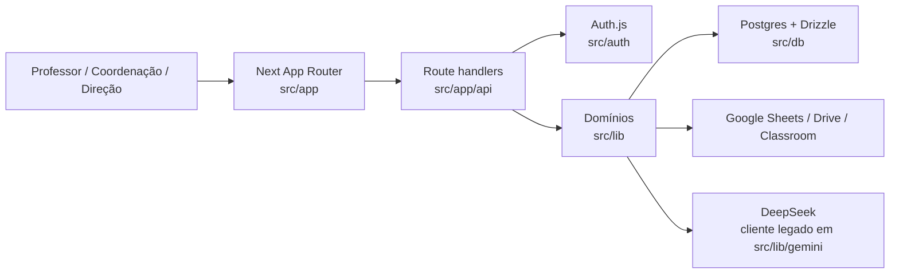

# Arquitetura Atual e Proposta de Reconstrução

**Status:** Diagnóstico concluído e fundação de runtime/cache atualizada em 19/07/2026.
**Escopo:** arquitetura de front-end; sem alteração de API, banco, autenticação ou deploy.

## 1. Estado atual

O Prova-TRI é uma aplicação Next.js 15 com App Router. Usa React 19,
TypeScript estrito, Tailwind CSS, Auth.js v5, Drizzle/Postgres, integrações
Google e geração com DeepSeek. O código de interface e os handlers HTTP vivem
no mesmo repositório e compartilham tipos do banco e do domínio.



### Rotas de interface inventariadas

| Área | Rota | Usuário/objetivo |
| --- | --- | --- |
| Entrada | `/`, `/login` | redirecionamento e autenticação institucional |
| Dashboard | `/dashboard` | visão de gestão ou fila do professor |
| Geração | `/gerar` | prévia curricular, banco ENEM e geração por IA |
| Revisão | `/gerar/[examId]/revisar` | revisar, classificar e mover a prova no fluxo |
| Correção | `/gerar/[examId]/corrigir` | corrigir respostas por aluno |
| Provas | `/status` | consultar, filtrar e acompanhar status |
| Turmas | `/turmas`, `/turmas/[courseId]` | Google Classroom, roster e notas |
| Desempenho | `/desempenho` | indicadores pedagógicos e perfis cognitivos |
| Administração | `/usuarios` | gestão de contas e cargos por superusuário |

### Fronteiras funcionais existentes

- `src/app/api/exams/**`: ciclo da prova, revisão, imagens, correções e devolução de notas.
- `src/app/api/stats/**` e `src/app/api/analytics/**`: agregações de dashboard e desempenho.
- `src/app/api/pedagogical/**`: classificações DOK, SOLO e revisão pedagógica.
- `src/lib/classroom`, `src/lib/docs`, `src/lib/gemini`, `src/lib/pedagogical` e `src/lib/sheets`: integrações e regras de domínio.
- `src/auth` e `src/middleware.ts`: sessão, domínio institucional, OAuth e proteção de rotas.

## 2. Diagnóstico técnico

### Pontos preserváveis

- O App Router, TypeScript estrito, Tailwind e aliases `@/*` são uma base válida para a reconstrução.
- A autorização no servidor foi centralizada em helpers relevantes, como `isStaffSuperuser`, `authorizeExamAccess` e `loadExamAndAuthorize`.
- O motor pedagógico é um domínio separado e extensível; deve continuar fora dos componentes visuais.
- Validadores Zod já protegem vários comandos sensíveis, especialmente geração, status e correções.

### Problemas arquiteturais observados

| Severidade | Evidência | Consequência | Direção |
| --- | --- | --- | --- |
| Alta | `DesempenhoPanel.tsx` tem 1.000 linhas e mistura filtro, busca, transformação e oito visualizações | alto custo para alterar ou testar uma métrica | fatiar por feature e por visualização na Fase 4/6 |
| Alta | `CurriculumPreview.tsx` (530), `RevisarExam.tsx` (689) e `CorrigirExam.tsx` (444) acumulam fluxo, estado e renderização | fluxos críticos frágeis e difíceis de tornar responsivos | dividir em containers, formulários e seções de domínio |
| Média | chamadas `fetch` e estados `loading/error` são repetidos em telas | feedback inconsistente, sem cache/invalidação uniforme | criar cliente HTTP e hooks/adaptadores por feature |
| Média | inexistem primitives de UI, tokens semânticos ou tema dark | aparência e acessibilidade variam por tela | criar design system antes de migrar telas |
| Média | runtime atualizado para Next 15/React 19 e TanStack Query adotado inicialmente; React Hook Form, Framer Motion, Recharts e Lucide ainda não foram introduzidos, e shadcn/ui existe apenas como base editável das primitives atuais | fundação atende parcialmente à stack-alvo | adotar cada biblioteca apenas quando houver uso e critério de aceite próprios na Fase 2 |
| Média | `src/app/api/analytics/performance/route.ts` ainda concentra a agregação em requisição | a Fase 9 paralelizou leituras, indexou questões e adicionou `Server-Timing`, mas não há pré-agregação para grande escala | acompanhar duração real e avaliar índice/agregação isolada quando o volume crescer |
| Baixa | layout global é um header fixo sem navegação responsiva, breadcrumb ou feedback de rota | orientação e uso móvel limitados | reconstruir na Fase 3 |

## 3. Arquitetura alvo

Não haverá um segundo backend. A migração cria uma camada de apresentação nova sobre os contratos atuais.

```text
src/
  app/                       # rotas, layouts e composição de página
  features/
    exams/                   # leitura, geração, revisão e status
    corrections/             # correção e devolução de notas
    classrooms/              # turmas e roster
    analytics/               # desempenho e dashboards
    users/                   # administração
  components/
    ui/                      # primitives reutilizáveis do design system
    layout/                  # navegação, header, breadcrumb, shell
    charts/                  # containers e acessibilidade de gráficos
  lib/
    api/                     # clientes tipados que preservam os contratos atuais
    formatters/              # formato de data, nota e rótulos
  types/
    api/                     # tipos de request/response extraídos dos contratos
```

### Regras de dependência

1. `components/ui` não importa de features, banco ou APIs.
2. `features` podem importar UI, tipos e `lib/api`; não importam handlers de rota nem Drizzle.
3. `app` apenas compõe tela, autorização de página e metadados; lógica de interação fica na feature.
4. `src/app/api`, `src/auth`, `src/db` e `src/lib` de domínio são preservados durante a migração.
5. Cada feature recebe um adaptador de API, para que contratos atuais não contaminem componentes de apresentação.

## 4. Estratégia de migração

1. Documentar os contratos e estabilizar regras de trabalho (Fase 1).
2. Criar tokens, primitives, tema e infraestrutura de formulários/cache sem tocar em tela de negócio (Fase 2).
3. Criar o shell global, inicialmente opt-in, mantendo as rotas existentes funcionais (Fase 3).
4. Migrar uma jornada completa por subtarefa, começando por dashboard e depois geração/revisão/correção.
5. Só retirar o componente legado depois de teste de regressão funcional, visual e de acessibilidade.

## 5. Restrições e pontos que exigem aprovação

- A atualização para Next 15.5.20 e React 19.2.7 foi concluída isoladamente na
  Fase 2.3. Rotas dinâmicas agora aguardam `params`, conforme o contrato do
  App Router atual, sem mudar os contratos HTTP expostos.
- A Fase 2.5 introduziu `src/lib/api/client.ts` como adaptador de consumo
  JSON no cliente. Ele centraliza cabeçalho `Accept`, serialização e a classe
  `ApiError`; handlers e contratos de `src/app/api` continuam a fonte de
  verdade, e nenhuma tela foi migrada nesta fundação.
- A Fase 2.7 introduziu um `QueryClientProvider` único no layout raiz,
  defaults conservadores em `src/lib/query/client.ts` e definições de query
  por feature. Somente `GET /api/stats/dashboard` foi migrado para
  `useQuery`; retry e refetch ao focar a janela ficam desativados, e o cache é
  considerado fresco por 60 segundos.
- O endereço público atual é produção. O ambiente DEV isolado é
  `192.168.1.218:3011`; nenhum deploy de reconstrução deve usar produção como
  substituto.
- O remoto oficial privado é
  `https://github.com/Colegio-Harmonia/prova-tri.git`; `main` e `develop`
  permanecem protegidas e recebem mudanças somente por Pull Request.
